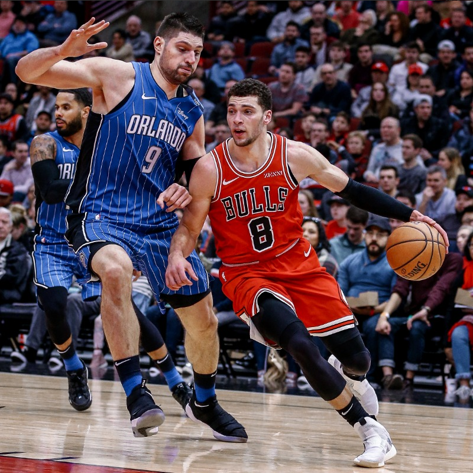

我还记得26号起床刷虎扑的兴奋，文武双全组合，听起来是那么美好。

但是2021年3月28号，公牛负于马刺。

不过这场比赛让我感觉到了武器的厉害之处，能投能突能传，最重要的是能挡。

这场比赛也更加暴露了这支球队传控不足的弊端，可惜交易截止日没能换来大球。

虽然这是一场失利，但是末节的追分也让球迷们保持住了希望。全明星终究是全明星，如果布朗能打出来，泰斯归队，准头找回。这个阵容未尝不能搅搅局。

2021.3.28，至少我还保持着希望。

