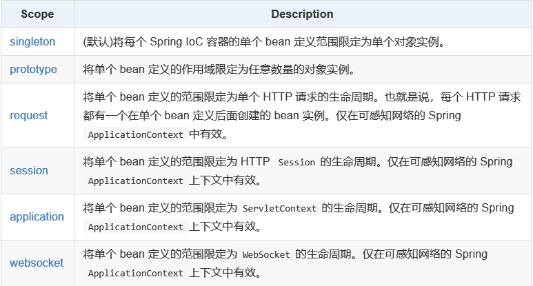

## 什么是Spring

Spring是一个以为IoC和AOP为内核的框架。IoC是Spring的基础。

> Spring Framework 中文文档：https://www.docs4dev.com/docs/zh/spring-framework/5.1.3.RELEASE/reference

## IoC（依赖反转）和Dl（依赖注入）

### 什么是IoC

在传统的面向对象编程方式中，获取对象的方式通常使用new关键字主动创建一个对象。

IoC方式则将对象的生命周期由Spring框架提供的IoC容器来管理，**IoC 容器实际上就是个Map（key，value）,Map 中存放的是各种对象。**当需要获取对象时直接从容器中取得，**控制权从应用程序交给了IoC容器。**所以称为控制反转，即IoC。

### 使用IoC的好处

将对象之间的相互依赖关系交给 IoC 容器来管理，并由 IoC 容器完成对象的注入。这样可以很大程度上简化应用的开发，把应用从复杂的依赖关系中解放出来。**IoC 容器就像是一个工厂一样，当我们需要创建一个对象的时候，只需要配置好配置文件/注解即可，完全不用考虑对象是如何被创建出来的。**



### IoC容器的源码分析

（占坑，暂时未读）

## Spring中的Bean

### Bean是什么

Bean指IoC容器中管理的类，要使用IoC容器中的Bean，需要对Bean进行配置。

### Bean的装配方式

#### 基于xml的配置方式

```xml
<?xml version="1.0" encoding="UTF-8"?>
<beans xmlns="http://www.springframework.org/schema/beans"
    xmlns:xsi="http://www.w3.org/2001/XMLSchema-instance"
    xsi:schemaLocation="http://www.springframework.org/schema/beans
        http://www.springframework.org/schema/beans/spring-beans.xsd">

    <bean id="..." class="...">  (1) (2)
        <!-- collaborators and configuration for this bean go here -->
    </bean>
</beans>
```

- **(1)** `id`属性是标识单个 bean 定义的字符串。
- **(2)** `class`属性定义 bean 的类型并使用完全限定的类名。

##### Dependency Injection(依赖注入)

###### 构造器注入

1. 参数下标赋值

   ```xml
   <bean id="user" class="com.uedkkk.hello.User">
       <constructor-arg index="0" value="i am a user"/>  <!--index代表参数下标-->
   </bean>
   ```

2. 参数类型赋值（不建议使用，因为无法解决参数冲突的问题）

   ```xml
   <bean id="user" class="com.uedkkk.hello.User">
       <constructor-arg type="java.lang.String" value="i am a user"></constructor-arg>
   </bean>
   ```

3. 通过参数名

   ```xml
   <bean id="user" class="com.uedkkk.hello.User">
       <constructor-arg name="name" value="i am a user"></constructor-arg>
   </bean>ter
   ```

###### setter方式注入

- 依赖：bean对象的所有属性依赖于容器
- 注入：bean对象中的所有属性由容器来注入
- **注意** 对应的pojo类中必须设置相应的setter方法


<!-- tab 普通值注入 -->

```xml
<bean id="user" class="com.uedkkk.hello.User">
    <property name="name" value="this is name"></property>
</bean>
```

<!-- endtab -->

<!-- tab Bean注入 -->

```xml
<bean id="Address" class="com.uedkkk.hello.Address"></bean> 
<bean id="user" class="com.uedkkk.hello.User">
    <property name="address" ref="Address"></property>  <!--address是成员类变量-->
</bean>
```

<!-- endtab -->

<!-- tab 数组注入 -->

```xml
<bean id="user" class="com.uedkkk.hello.User">
    <property name="books">                <!--books是一个String数组-->
        <array>
            <value>book1</value>
            <value>book2</value>
            <value>book3</value>
            <value>book4</value>
        </array>
    </property>
</bean>
```

<!-- endtab -->

<!-- tab List注入 -->

```xml
<bean id="user" class="com.uedkkk.hello.User">
    <property name="list">                <!--list是一个List<String>-->
        <list>
            <value>item1</value>
            <value>item2</value>
            <value>item3</value>
            <value>item4</value>
        </list>
    </property>
</bean>
```

<!-- endtab -->

<!-- tab Map注入 -->

```xml
<bean id="user" class="com.uedkkk.hello.User">
    <property name="map">				<!--map是一个Map<String,String>-->
    	<map>
        	<entry key="key1" value="value1"></entry>
        	<entry key="key2" value="value2"></entry>
        	<entry key="key3" value="value3"></entry>
        	<entry key="key4" value="value4"></entry>
    	</map>
	</property>
</bean>
```

<!-- endtab -->

<!-- tab Set注入 -->

```xml
<bean id="user" class="com.uedkkk.hello.User">
    <property name="set">                <!--set是一个set<String>-->
        <set>
            <value>item1</value>
            <value>item2</value>
            <value>item3</value>
            <value>item4</value>
        </set>
    </property>
</bean>
```

<!-- endtab -->

<!-- tab Null值注入 -->

```xml
<bean id="user" class="com.uedkkk.hello.User">
    <property name="name">
    	<null/>
	</property>   
</bean>
```

<!-- endtab -->



###### 拓展方式注入

- p命名空间和c命名空间都需要导入依赖

  ```xml
  <!--p-->
  xmlns:p="http://www.springframework.org/schema/p"
  <!--c-->
  xmlns:c="http://www.springframework.org/schema/c"
  ```

- p命名空间

  ```xml
  <beans xmlns="http://www.springframework.org/schema/beans"
      xmlns:xsi="http://www.w3.org/2001/XMLSchema-instance"
      xmlns:p="http://www.springframework.org/schema/p"    //注意加入此句依赖
      xsi:schemaLocation="http://www.springframework.org/schema/beans
          http://www.springframework.org/schema/beans/spring-beans.xsd">
  	<!--旧的方式-->
      <bean name="classic" class="com.example.ExampleBean">
          <property name="email" value="[emailprotected]"/>
      </bean>
  	<!--p命名空间方式-->
      <bean name="p-namespace" class="com.example.ExampleBean"
          p:email="[emailprotected]"/>
  </beans>
  ```

- c命名空间

  ```xml
  <beans xmlns="http://www.springframework.org/schema/beans"
      xmlns:xsi="http://www.w3.org/2001/XMLSchema-instance"
      xmlns:c="http://www.springframework.org/schema/c"   //加入此句依赖
      xsi:schemaLocation="http://www.springframework.org/schema/beans
          http://www.springframework.org/schema/beans/spring-beans.xsd">
  
      <bean id="thingOne" class="x.y.ThingTwo"/>
      <bean id="thingTwo" class="x.y.ThingThree"/>
  
      <!--旧的方式-->
      <bean id="thingOne" class="x.y.ThingOne">
          <constructor-arg ref="thingTwo"/>
          <constructor-arg ref="thingThree"/>
          <constructor-arg value="[emailprotected]"/>
      </bean>
  
      <!--c命名空间方式-->
      <bean id="thingOne" class="x.y.ThingOne" c:thingTwo-ref="thingTwo" c:thingThree-ref="thingThree" c:email="[emailprotected]"/>
  
  </beans>
  ```

#### 自动装配

可以使用`<bean>`元素的`autowire`属性为一个 bean 定义指定自动装配模式。

##### `byName`

会自动寻找和自己对象set方法中参数名相同的beanid。

```xml
<bean id="accountService" class="com.something.DefaultAccountService" scope="prototype" autowire="byName"/>
```

##### `byType`

会自动寻找和自己对象set方法中参数类型相同的bean。

```xml
<bean id="accountService" class="com.something.DefaultAccountService" scope="prototype" autowire="byType"/>
```

##### `constructor`

```xml
   <bean id="bean1" class="com.example.bean1" 
      autowire="constructor">
      <constructor-arg value="this is another value"/>
   </bean>
	<!--bean1的有参构造函数包含一个类型为bean2的参数-->
   <!-- Definition for another bean -->
   <bean id="bean2" class="com.example.bean2">
   </bean>
```

#### 基于Annotation的装配

注解连线在默认情况下在 Spring 容器中不打开。因此，在可以使用基于注解的连线之前，需要在 Spring 配置文件中启用它。

1. 导入context约束

   ```xml
   xmlns:context="http://www.springframework.org/schema/context"
   ```

2. 配置支持: 

   ```xml
   <context:annotation-config/>
   ```

   完整如下

   ```xml
   <?xml version="1.0" encoding="UTF-8"?>
   <beans xmlns="http://www.springframework.org/schema/beans"
       xmlns:xsi="http://www.w3.org/2001/XMLSchema-instance"
       xmlns:context="http://www.springframework.org/schema/context"
       xsi:schemaLocation="http://www.springframework.org/schema/beans
           http://www.springframework.org/schema/beans/spring-beans.xsd
           http://www.springframework.org/schema/context
           http://www.springframework.org/schema/context/spring-context.xsd">
   
       <context:annotation-config/>
   
   </beans>
   ```

##### `@Required`

`@Required`注释应用于 bean 属性的 setter 方法，它表明受影响的 bean 属性在配置时**必须**放在 XML 配置文件中，否则容器就会抛出一个 `BeanInitializationException`异常。

```java
public class Student {
   private Integer age;
   @Required
   public void setAge(Integer age) {
      this.age = age;
   }
   public Integer getAge() {
      return age;
   }
}
```

##### `@Autowired`

`@Autowired`可以说是使用最多的注释，是一个用于容器配置的注释，功能是为我们注入一个定义好的 bean。

`@Autowired`的用法有很多种。可以用于

- 构造函数
- setter 方法
- 具有任意名称和多个参数的方法
- 字段（运用最多的方式）

将`@Autowired`注释添加到需要该类型数组的字段或方法，则 Spring 会从`ApplicationContext`中搜寻符合指定类型的所有 bean。

##### `@Qualifier`

当具有相同类型的 bean 时，并且想要用一个属性只为它们其中的一个进行装配，在这种情况下，你可以使用`@Qualifier`注释和`@Autowired`注释通过指定哪一个真正的 bean 将会被装配来消除混乱(因为`@Autowired`只通过byName方式装填)。

```java
public class Profile {
   @Autowired
   @Qualifier("student1")
   private Student student;
}
```

```xml
<bean id="student1" class="com.tutorialspoint.Student">
    <property name="name"  value="Zara" />
    <property name="age"  value="11"/>
</bean>

<bean id="student2" class="com.tutorialspoint.Student">
    <property name="name"  value="Nuha" />
    <property name="age"  value="2"/>
</bean>
```

此时Profile中的student将会是**id为student1**的bean。

##### `@Resource`（java的注解）

同样可以实现`@Autowire`的功能。

```java
@Resource
//或者
@Resource(name = "xxx")					//xxx是需要装配的beanid
```

##### `@Resource`和`@Autowired`的区别

- `@Resource`

  默认byName注入。

  当`@Resource`标注在字段上，即默认取字段的名称作为bean名称寻找依赖对象。

  当`@Resource`标注在属性的setter方法上，即默认取属性名作为bean名称寻找依赖对象。

  `@Resource`如果没有指定name属性，并且按照默认的名称仍然找不到依赖对象时，`@Resource`会回退到按类型装配。**但一旦指定了任意属性，就只能该属性装配了。**

- `@Autowired`

  只按照byType注入。如果我们想使用按名称装配，可以结合`@Qualifier`一起使用。

  ```java
  @Qualifier(value = "xxx")					//xxx是需要装配的beanid
  ```


### Bean的作用域

- 通过配置文件中的`scope`属性进行配置



#### 单例范围（spring默认模式）

```xml
<bean id="accountService" class="com.something.DefaultAccountService"/>
<!--设定单例范围-->
<bean id="accountService" class="com.something.DefaultAccountService" scope="singleton"/>
```

> 当定义一个 bean 定义并且其作用域为单例时，Spring IoC 容器将为该 bean 定义所定义的对象创建一个实例。该单个实例存储在此类单例 bean 的高速缓存中，并且对该命名 bean 的所有后续请求和引用都返回该高速缓存的对象。

>
   > 

#### 原型范围

```xml
<bean id="accountService" class="com.something.DefaultAccountService"/>
<!--设定原型范围-->
<bean id="accountService" class="com.something.DefaultAccountService" scope="prototype"/>
```

> 每次对特定 bean 提出请求时，bean 部署的非单一原型范围都会导致创建一个新 bean 实例。
>
> 也就是说每次get的时候都会new一个新对象。
>
> 

### Bean定义继承

可以定义一个父 bean 的定义作为模板和其他子 bean 就可以从父 bean 中继承所需的配置。

``` xml
   <bean id="helloWorld" class="com.tutorialspoint.HelloWorld">
      <property name="message1" value="Hello World!"/>
      <property name="message2" value="Hello Second World!"/>
   </bean>

   <bean id="helloIndia" class="com.tutorialspoint.HelloIndia" parent="helloWorld">
      <property name="message1" value="Hello India!"/>
      <property name="message3" value="Namaste India!"/>
   </bean>

</beans>
```

## Spring框架的AOP

Spring 框架的一个关键组件是**面向方面的编程**(AOP)框架。面向方面的编程需要把程序逻辑分解成不同的部分称为所谓的关注点。跨一个应用程序的多个点的功能被称为**横切关注点**，这些横切关注点在概念上独立于应用程序的业务逻辑。

在 OOP 中，关键单元模块度是类，而在 AOP 中单元模块度是方面。依赖注入帮助你对应用程序对象相互解耦和 AOP 可以帮助你从它们所影响的对象中对横切关注点解耦。

> 自我理解：原本的程序就像一道瀑布一样笔直往下流，而AOP则可以切断瀑布，在断点处插入需要实现的功能。

### AOP术语

| 项            | 描述                                                         |
| ------------- | ------------------------------------------------------------ |
| Aspect        | 一个模块具有一组提供横切需求的 APIs。                        |
| Join point    | 在应用程序中它代表一个点，可以在插件 AOP 方面。也可以说它是在实际的应用程序中，其中一个操作将使用 Spring AOP 框架。 |
| Advice        | 这是实际行动之前或之后执行的方法。这是在程序执行期间通过 Spring AOP 框架实际被调用的代码。 |
| Pointcut      | 这是一组一个或多个连接点，通知应该被执行。可以使用表达式或模式指定切入点。 |
| Introduction  | 引用允许添加新方法或属性到现有的类中。                       |
| Target object | 被一个或者多个方面所通知的对象，这个对象永远是一个被代理对象。也称为被通知对象。 |
| Weaving       | Weaving 把方面连接到其它的应用程序类型或者对象上，并创建一个被通知的对象。这些可以在编译时，类加载时和运行时完成。 |

### 通知的类型

Spring 方面可以使用下面提到的五种通知工作：

| 通知           | 描述                                                         |
| -------------- | ------------------------------------------------------------ |
| 前置通知       | 在一个方法执行之前，执行通知。                               |
| 后置通知       | 在一个方法执行之后，不考虑其结果，执行通知。                 |
| 返回后通知     | 在一个方法执行之后，只有在方法成功完成时，才能执行通知。     |
| 抛出异常后通知 | 在一个方法执行之后，只有在方法退出抛出异常时，才能执行通知。 |
| 环绕通知       | 在建议方法调用之前和之后，执行通知。                         |

### 实现方式

#### Spring 中基于 AOP 的 XML架构

以例子说明

需要导入spring-aop j架构

```xml
<?xml version="1.0" encoding="UTF-8"?>
<beans xmlns="http://www.springframework.org/schema/beans"
    xmlns:xsi="http://www.w3.org/2001/XMLSchema-instance" 
    xmlns:aop="http://www.springframework.org/schema/aop"
    xsi:schemaLocation="http://www.springframework.org/schema/beans
    http://www.springframework.org/schema/beans/spring-beans-3.0.xsd 
    http://www.springframework.org/schema/aop 
    http://www.springframework.org/schema/aop/spring-aop-3.0.xsd ">

</beans>
```

##### 接口实现AOP

advisor的实现类（通过实现接口）

```java
public class Before implements MethodBeforeAdvice {
    @Override
    public void before(Method method, Object[] objects, Object o) throws Throwable {
        System.out.println(o.getClass().getName()+"的"+method.getName()+"被执行了！");
    }
}
```

在`applicationContext.xml`中注册advisor类

```xml
<bean id="Before" class="com.uedkkk.userserve.Before"/>
```

配置`aop-config`

```xml
<aop:config>
    <aop:pointcut id="pointcut" 
                  expression="execution(* com.uedkkk.userserve.UserserviceImpl.*(..))"/>
    <aop:advisor advice-ref="Before" pointcut-ref="pointcut"/>
    <aop:advisor advice-ref="After" pointcut-ref="pointcut"/>
</aop:config>
```

解读：

	- exexution为编织进入的表达式
 - 第一个`*`代表修饰符
 - `com.uedkkk.userserve.UserserviceImpl`代表切点类
 - 第二个`*`代表此类中所有的方法
 - (..)代表这个方法中的参数列表

```xml
execution(* com.uedkkk.userserve.UserserviceImpl.*(..))
```

##### 自定义切面类

实现自定义的切面类

```java
public class DiyPoingCut {
    public void before(){
        System.out.println("=============方法执行前============");
    }
    public void aftertest(){
        System.out.println("=============方法执行后============");
    }
}
```

```xml
<aop:config>
    <aop:pointcut id="pointcut" 
                  expression="execution(* com.uedkkk.userserve.UserserviceImpl.*(..))"/>
    <aop:aspect ref="diy">
        <aop:before method="before" pointcut-ref="pointcut"/>
        <aop:after method="aftertest" pointcut-ref="pointcut"/>
    </aop:aspect>
</aop:config>
```

##### 通过注解实现AOP

注解标注aspect类

```java
@Aspect
public class DiyByannotation {
    @Before("execution(* com.uedkkk.userserve.UserserviceImpl.*(..))")
    public void before(){
        System.out.println("=================注解搞定before==============");
    }
}
```

配置文件中开启注解

```xml
<bean id="diyByannotation" class="com.uedkkk.diy.DiyByannotation"/>
<aop:aspectj-autoproxy/>
```

